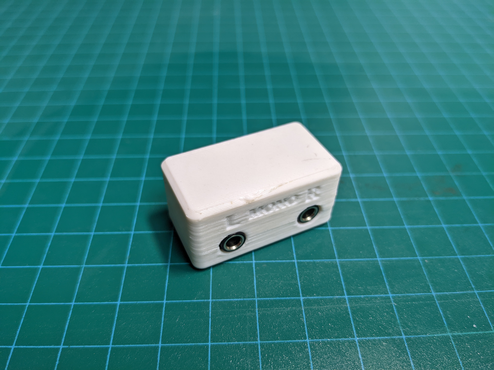

# Dual Mono Stereo Switch Adapter
The Dual-Mono-Stereo Switch Adapter provides a way to connect two assistive switches with 3.5 mm / 1/8 in mono cables to a single 3.5 mm / 1/8 in stereo input on a compatible assistive technology device. 

## Usage 
To use the Dual Mono-Stereo Adapter, connect the two assistive switches to the Left and Right Inputs on the adapter. Then connect the adapter to the AT device with a stereo male-to-male extension cable.

## More info at
- [Makers Making Change Project Page](https://makersmakingchange.com/project/dual-mono-stereo-adapter/)

## Getting Started

### 1. Order the Off-The-Shelf Components

The [Bill of Materials](/Documentation/Dual-Mono-Stereo_Adapter_BOM_v1.0.csv) lists all of the parts and components required to build the Open Wobble Switch. The main switch component needs to be ordered online. The rest of the off-the-shelf components are also online or may be available in smaller quantities at your local hardware store or dollar store.

### 2. Print the 3D Printable components

3D print the components. Refer to the [3D Printing Guide](/Documentation/Dual-Mono-Stereo_Adapter_3D_Print_Guide_v1.0.pdf).

All of the files and individual print files can be in the [/Build_Files/3D_Printing_Files](/Build_Files/3D_Printing_Files/) folder.

### 3. Assemble the Device

Reference the [Assembly Guide](/Documentation/Dual-Mono-Stereo_Adapter_Assembly_Guide_v1.0.pdf) for the tools and steps required to build each portion.

## Files
### Documentation
| Document             | Version | Link |
|----------------------|---------|------|
| Design Rationale     | 1.0     | [Dual-Mono-Stereo_Adapter_Design_Rationale](/Documentation/Dual-Mono-Stereo_Adapter_Design_Rationale_v1.0.pdf)     |
| Bill of Materials    | 1.0     | [Dual-Mono-Stereo_Adapter_Bill_of_Materials](/Documentation/Dual-Mono-Stereo_Adapter_BOM_v1.0.csv)     |
| 3D Print Guide       | 1.0     | [Dual-Mono-Stereo_Adapter_3D_Print_Guide](/Documentation/Dual-Mono-Stereo_Adapter_3D_Print_Guide_v1.0.pdf)     |
| Assembly Guide       | 1.0     | [Dual-Mono-Stereo_Adapter_Assembly_Guide](/Documentation/Dual-Mono-Stereo_Adapter_Assembly_Guide_v1.0.pdf)     |
| Maker Checklist      | 1.0     | [Dual-Mono-Stereo_Adapter_Maker_Checklist](/Documentation/Dual-Mono-Stereo_Adapter_Maker_Checklist_v1.0.pdf)     |
| User Guide           | 1.0     | [Dual-Mono-Stereo_Adapter_User_Guide](/Documentation/Dual-Mono-Stereo_Adapter_User_Guide_v1.0.pdf)    |
| Changelog            | 1.0     | [Dual-Mono-Stereo_Adapter_ChangeLog](/Documentation/Dual-Mono-Stereo_Adapter_ChangeLog_v1.0.pdf)     |

### Design Files
[CAD Files](/Design_Files)

### Build Files
 - [3D Printing Files](/Build_Files/3D_Printing_Files)
 - [3D Printing Guide](/Documentation/Dual-Mono-Stereo_Adapter_3D_Print_Guide_v1.0.pdf)

## Attribution
Designed and documented by Makers Making Change

### Contributors
 - Jake McIvor, Neil Squire Society / Makers Making Change

## License
Everything needed or used to design, make, test, or prepare the Dual-Mono-Stereo Switch Adapter is licensed under the CERN 2.0 Permissive license https://ohwr.org/project/cernohl/wikis/Documents/CERN-OHL-version-2 (CERN-OHL-P) .

Accompanying material such as instruction manuals, videos, and other copyrightable works that are useful but not necessary to design, make, test, or prepare the Dual-Mono-Stereo Switch Adapter are published under a Creative Commons Attribution-ShareAlike 4.0 license https://creativecommons.org/licenses/by-sa/4.0/ (CC BY-SA 4.0)

<!-- ABOUT MMC START -->
## About Us

Makers Making Change is an initiative of [Neil Squire](https://www.neilsquire.ca/), a Canadian non-profit that helps people with disabilities.

We are committed to cultivating a network of volunteer makers who support people with disabilities in their communities through 3D printing assistive devices. Check out our library of free, open-source assistive technologies with parts and build instructions.

 - [www.MakersMakingChange.com](https://www.makersmakingchange.com/)
 - [GitHub](https://github.com/makersmakingchange)
 - [Thingiverse](https://www.thingiverse.com/makersmakingchange/about)
 - Twitter: [@makermakechange](https://twitter.com/makermakechange)
 - Instagram: [@makersmakingchange](https://www.instagram.com/makersmakingchange)

## Contact Us

For technical questions, to get involved, or share your experience we encourage you to visit the [MMC Project Page]( https://www.makersmakingchange.com/project), [MMC Forum](https://makersmakingchange.com/forum), or contact info@makersmakingchange.com
<!-- ABOUT MMC END -->
